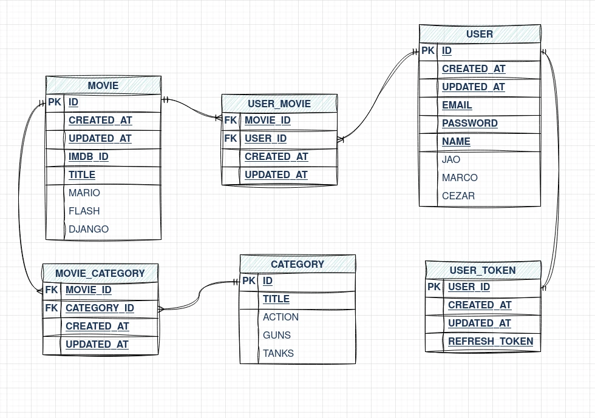

# XP MOVIES

Express api for saving favorites movies

## Database diagram




## API Reference

### Create new user

```http
  POST /register
```

Body:

```json
  {
    "name": string,
    "email": string,
    "password": string
  }
```

### Login

```http
  POST /login
```

Body:

```json
  {
    "email": string,
    "password": string
  }
```

### Add new favorite movie

```http
  POST /user/addFavorite
```

Header:

```json
  Authorization = eyJhbGciOiJIUzI1NiIsInR5cCI6IkpXVCJ9...
```

Body:

```json
  {
    "imdbId": string,
    "category": string,
    "movieName": string
  }
```

### Get all user favorite movies

```http
  GET /favorites/all
```

Header:

```json
  Authorization = eyJhbGciOiJIUzI1NiIsInR5cCI6IkpXVCJ9...
```

---

TODO:
  - [ ] swagger docs
  - [ ] redis cache
  - [ ] kubernetes pods
  - [ ] lambda crons
  - [ ] free and paid user features
  - [ ] GraphQL 
  - [ ] WebSocket
