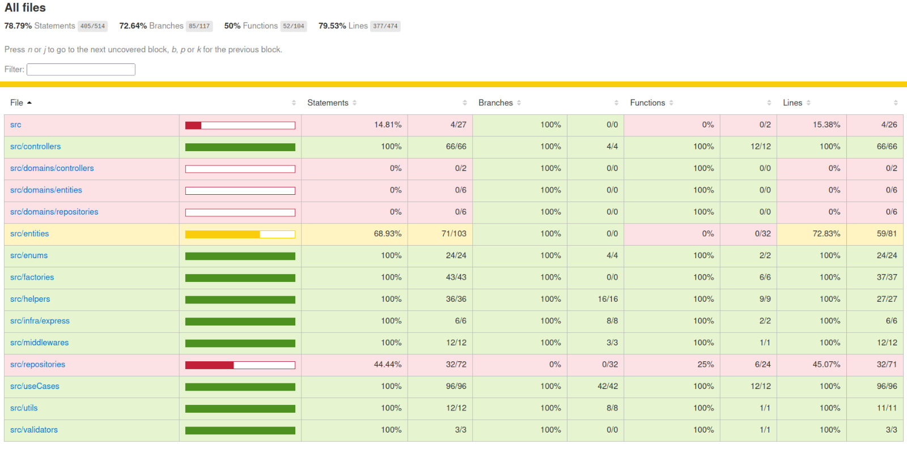

<h1 align='center'>XP MOVIES</h1>
<p align='center'>Express api for saving favorites movies</p>

## Database diagram


---

## API Reference
Now can be found [here](https://williamsjose.github.io/xp-movies/).

---

## Coverage


---

## To run this project you'll need [Docker](https://docs.docker.com) installed

1. ### First Clone repo
```
git clone https://github.com/WilliamsJose/xp-movies.git 
cd xp-movies
```

2. #### Rename *EXAMPLE.env* to *.env*

3. ### Install dependencies
```
yarn
```

4. ### Prepare Database
```
docker run --name mysql -p 5456:3306 -e MYSQL_DATABASE=xp_movies -e MYSQL_USER=admin -e MYSQL_PASSWORD=admin -e MYSQL_ROOT_PASSWORD=root -d mysql:8
yarn migration:generate
yarn migration:run
```
You should see
>Migration Default1730474560233 has been  executed successfully.
>query: COMMIT
>xp-movies@1.0.0 seed
>ts-node seed.ts
>Seeding concluído com sucesso.
>Done in 5.79s.

5. ### Start server
```
yarn dev
```
When you see this, everytihing is working:
>server up

6. ### Follow this [APi Reference](https://williamsjose.github.io/xp-movies/) for testing

TODO:
- [x] SOLID
- [x] Clean code
- [x] Clean architecture
- [x] Swagger docs
- [x] Jest
  - [ ] Augment coverage
- [ ] Redis cache
- [ ] Kubernetes pods
- [ ] Lambda crons
- [ ] Free and Paid user features
- [ ] GraphQL
- [ ] WebSocket
