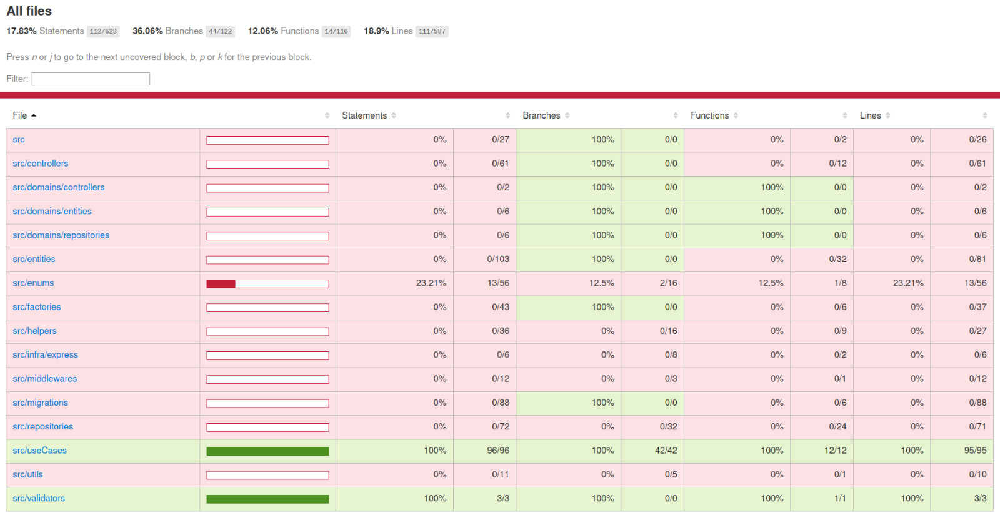

<h1 align='center'>XP MOVIES</h1>

Express api for saving favorites movies

## Database diagram

---

## API Reference
Now can be found [here](https://williamsjose.github.io/xp-movies/).

---

## Coverage

---

TODO:
- [x] SOLID
- [x] Clean code
- [x] Clean architecture
- [x] swagger docs
- [x] Jest
  - [ ] Augment coverage
- [ ] Redis cache
- [ ] Kubernetes pods
- [ ] Lambda crons
- [ ] Free and Paid user features
- [ ] GraphQL
- [ ] WebSocket
